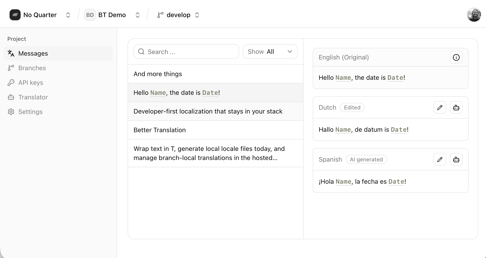

# Better Translation

Better Translation is a Vite plugin and runtime for adding AI-assisted translations to Vite apps.

Add the plugin, mark UI copy in your source, and Better Translation generates flat Locale value JSON files plus the virtual runtime loader your app uses to render translated Messages.

[Website](https://www.better-translation.dev) · [Documentation](https://docs.better-translation.dev)

## What You Get

- A Vite plugin that scans source files for Translation markers.
- Stable lookup ids generated from Message text, placeholders, and context.
- Local Runtime bundles as flat `id -> translated string` JSON objects.
- React and Svelte helpers for marking UI copy and reading Locale values at runtime.
- Optional dev-time translation through your own async `translate()` function.
- Optional dev-only local editor for local Locale values.

## Requirements

- Node 24 or later
- Vite 8 or later
- React 19 or later when using `better-translation/react`
- Svelte 5 and `@sveltejs/vite-plugin-svelte` when using `better-translation/svelte`

This repo uses Bun:

```bash
bun install
```

## Quick Start

Install the package in a TanStack Start app:

```bash
bun add better-translation
```

Add the Vite plugin before the TanStack Start and React plugins:

```ts
// vite.config.ts
import { tanstackStart } from "@tanstack/react-start/plugin/vite"
import { defineConfig } from "vite"
import react from "@vitejs/plugin-react"
import { betterTranslation } from "better-translation/vite"

export default defineConfig({
  plugins: [
    betterTranslation({
      locales: ["en", "es", "fr"],
      defaultLocale: "en",
    }),
    tanstackStart(),
    react(),
  ],
})
```

If your Start app also uses plugins such as Nitro, Tailwind, or tsconfig-path resolution, keep `betterTranslation()` before the plugins that transform React route code.

For Svelte apps, keep `betterTranslation()` before the Svelte plugin:

```ts
// vite.config.ts
import { svelte } from "@sveltejs/vite-plugin-svelte"
import { defineConfig } from "vite"
import { betterTranslation } from "better-translation/vite"

export default defineConfig({
  plugins: [
    betterTranslation({
      locales: ["en", "es", "fr"],
      defaultLocale: "en",
    }),
    svelte(),
  ],
})
```

The default local runtime works well for TanStack Start. It writes generated Locale values under `src/lib/bt` and exposes them through the virtual `better-translation/messages` module.

Load messages in your root route's `beforeLoad`, then wrap the route outlet:

```tsx
// src/routes/__root.tsx
import { createRootRoute, Outlet } from "@tanstack/react-router"
import { loadMessages } from "better-translation/messages"
import { TranslateProvider } from "better-translation/react"

import { getLocale } from "./-locale"

export const Route = createRootRoute({
  beforeLoad: async () => {
    const locale = await getLocale()
    const messages = await loadMessages(locale)

    return { locale, messages }
  },
  component: RootComponent,
})

function RootComponent() {
  const { locale, messages } = Route.useRouteContext()

  return (
    <TranslateProvider locale={locale} messages={messages}>
      <Outlet />
    </TranslateProvider>
  )
}
```

`getLocale()` is whatever your app uses to resolve the active Locale, such as a cookie, route param, or request header.
Passing it to `TranslateProvider` lets completed local development translations replace the authored fallback without
reloading the page or remounting application state.

Mark UI copy where you author it:

```tsx
import { T, useT } from "better-translation/react"

export function CheckoutButton() {
  const t = useT()

  return (
    <button aria-label={t("Complete checkout")}>
      <T>Pay now</T>
    </button>
  )
}
```

Static inline elements inside React and Svelte `<T>` markers are preserved automatically while their text is translated:

```tsx
<T>
  Always make sure <strong>you are safe first</strong> before approaching the casualty.
</T>
```

This works with supported inline elements such as `<strong>`, `<b>`, `<i>`, `<em>`, `<span>`, `<a>`, and `<br />`, including
nested elements. Source-owned React components such as `<B>` or `<Text.Italic>` and normal Svelte components work too, so a
design-system component can render `<b>` or another element under the hood. Better Translation represents each authored
element or component as a numbered rich-text tag in the Message, then restores that same source-owned renderer and its props
at runtime. Consumer apps do not import a parser, register tag callbacks, or validate translations themselves. Translated
strings never become arbitrary HTML, and dynamic values should still use `<Var>`.

Run your dev server. The plugin scans your source and writes Runtime bundles for each configured Locale.

```bash
bun run dev
```

## Local Runtime Options

Local mode is the account-free workflow. The plugin owns local Locale value files and your app loads those values at runtime.

```ts
betterTranslation({
  locales: ["en", "es", "fr"],
  defaultLocale: "en",
  runtime: {
    type: "local",
    target: "module",
  },
})
```

Use `target: "module"` when Vite can import generated files from source. Use `target: "public"` when the runtime should fetch JSON from public assets instead:

```ts
betterTranslation({
  locales: ["en", "es", "fr"],
  defaultLocale: "en",
  runtime: {
    type: "local",
    target: "public",
  },
})
```

## Filling Missing Translations

Local mode can call a `translate()` function during dev for missing non-default Locale values:

```ts
import { createAiTranslate } from "better-translation/ai"
import { betterTranslation } from "better-translation/vite"

betterTranslation({
  locales: ["en", "es", "fr"],
  defaultLocale: "en",
  runtime: {
    type: "local",
    translationBatchSize: 25,
    translate: createAiTranslate({
      prompt: "Use concise product UI copy.",
    }),
  },
})
```

You can also pass your own `translate(messages, locale)` implementation. Return a record keyed by lookup id.
`translationBatchSize` controls how many missing Messages are sent to that function before the cache and local Runtime bundles are
persisted, so completed batches survive an interruption.

## Local Editor

Enable the dev-only editor when you want to search Messages and edit local Locale values in the browser:

```ts
betterTranslation({
  locales: ["en", "es", "fr"],
  defaultLocale: "en",
  runtime: {
    type: "local",
    editor: true,
  },
})
```

By default it is served during `vite dev` at `/__better-translation`.



## Hosted Platform Direction

Better Translation is moving toward a hosted workflow where the Vite plugin syncs a Manifest to a Project, Branches isolate Locale value changes, and Consumer apps load flat Runtime bundles by Project, Branch, and Locale.

The current package keeps the local bundle-first workflow working while the hosted service evolves.

## Repo Layout

- `packages/better-translation`: published Vite plugin, runtime helpers, local editor middleware, and AI translation helper.
  Public build entry modules stay at the top of `src`; private Message grammar lives in `src/message`, Vite-plugin behavior in
  `src/vite-plugin`, and Svelte implementation files in `src/svelte`.
- `apps/web`: hosted app and service scaffold.
- `apps/docs`: documentation site.
- `examples/tanstack-start`: local-first TanStack Start example.
- `examples/svelte-kit`: local-first SvelteKit example.
- `CONTEXT.md`: canonical product vocabulary.
- `docs/platform.md`: current platform behavior and intended hosted-service direction.

## Development

Run routine verification from the repo root:

```bash
bun run format
bun run lint
bun run check
bun run test
```

Build the published package:

```bash
bun --filter better-translation build
```

Measure Vite-plugin and runtime performance with statistically sampled benchmarks:

```bash
bun run bench:performance
```

`bun run test` also runs coarse scaling guards. They reject gross superlinear growth across TypeScript and Svelte source
analysis, Message-template parsing, Manifest aggregation, and cached source edits without relying on hardware-specific
millisecond limits. Use
`bun run bench:performance:json` when benchmark results need to be captured for a same-machine comparison.

The package regression suite is split by the interface it protects:

- `packages/better-translation/test/source-analysis.test.ts`: extraction, source edits, and diagnostics.
- `packages/better-translation/test/runtime.test.tsx`: React and Svelte rendering, interpolation, and rich text.
- `packages/better-translation/test/vite-plugin.test.ts`: Manifest, cache, local artifacts, and plugin lifecycle.

## Documentation

The docs app has the fuller guide and API reference:

- `apps/docs/content/docs/index.mdx`: quick start
- `apps/docs/content/docs/how-it-works.mdx`: extraction and runtime model
- `apps/docs/content/docs/local-mode.mdx`: local Runtime bundles and editor
- `apps/docs/content/docs/reference.mdx`: API reference
